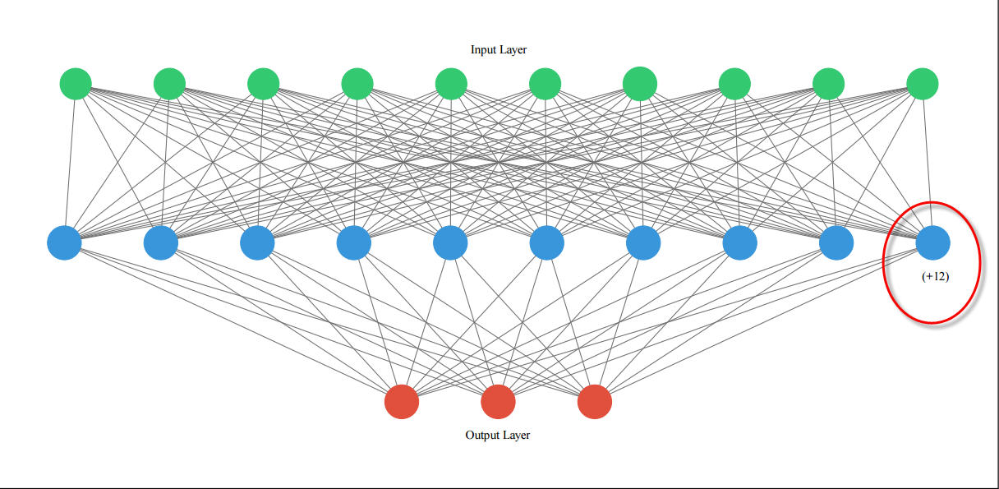
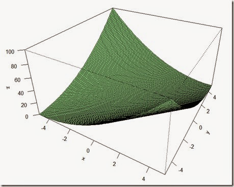
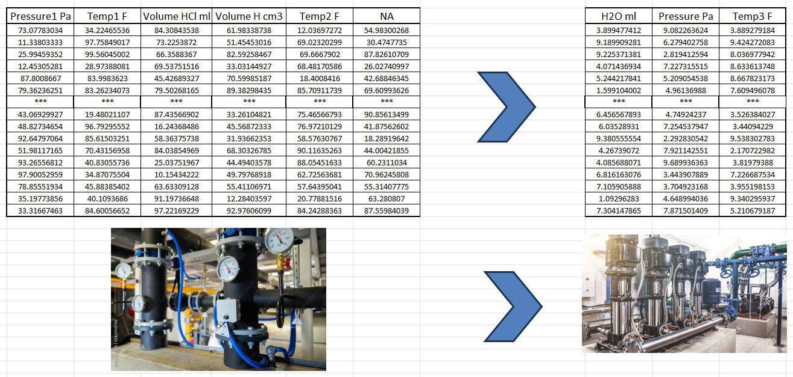

# Process Optimization for the Industries

## Goal
The objective of this project is to develop a proof of concept that simulates the requirements of various process industries. The aim is to establish a set of input parameters and analyze their impact on the output parameters. This approach can be applied to a wide range of applications, including chemical processes, wine production, and numerous other industrial processes.

## Methodology
- **Predictive Analysis**: Classification model helps predict the probability of purchasing each product. The predicted probabilities are latter used for clustering. 

- **Clustering**: Clustering helps explore market segmentation and opportunities. 
 
   

## Challenges
- **Unbalanced Data**: Most products have low penetration. Therefore, it creates unbalanced data when building classification models. To counter this issue, up-sampling is used in modeling process.

- **Model Improvement - AUC**: Several classification and ensemble models were applied to select best model. The best model and technique are identified in this project. 
 
[]
 

## Results
- The prediction performance is evaluated via the **AUC** value, on test set across most products. The high AUCs gives confidence to use the predicted probabilities of purchasing for clustering. 
- An ideal number of clustering is identified to **provide actionable recommendations and product strategy**. AAA could reduce its costs, and advertize their Credit Cards and Mortgage offers.  
**Input: [-0.99859353,2.19284309,-0.42632569,-0.21043258,-1.13655612,-0.55671602,-0.63169045,-0.87625098,-0.99445578,-0.3677487]** 
**Predicted: [-25.883106 -33.14987  -29.517544]** 
 
  
